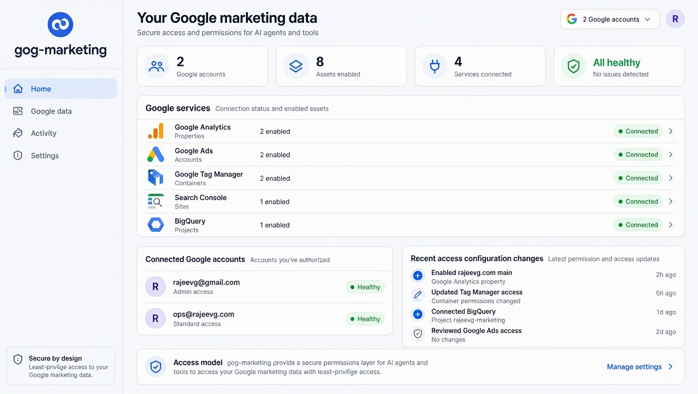

# gog-marketing

**Standard gog, extended with marketing APIs and controlled agent access.**



`gog-marketing` is a **superset of standard `gog`**. It retains the existing
Google Workspace command surface for Gmail, Calendar, Drive, Docs, Sheets,
Slides, Chat, Contacts, Tasks, People, Forms, Meet, Classroom, Apps Script,
Workspace administration and the other capabilities already present in the
fork, while adding richer marketing access such as Google Analytics, Google
Ads, Google Tag Manager, Search Console and BigQuery.

The same typed `gog` engine powers people, scripts and agents. The product
layer adds centrally managed connections, service/resource permissions,
connection health, auditability and a marketer-friendly UI. It does **not**
replace standard `gog` with a five-service marketing client.

The web interface is an access and permissions layer, not an analytics or
reporting dashboard. Normal product screens show what an agent may use rather
than customer marketing performance.

## Product surface

### Workspace / standard gog

Standard `gog` functionality remains part of this fork. Existing commands such
as Gmail, Calendar, Drive, Docs, Sheets, Slides and the wider Workspace surface
continue to work through the `gog` binary.

### Marketing

The fork adds or expands typed marketing capabilities including **Google
Analytics, Google Ads, Google Tag Manager, Search Console and BigQuery**, plus
the existing marketing-adjacent surfaces already inherited from `gog`.

The product UI groups these capabilities clearly as **Workspace** and
**Marketing** rather than hard-coding a five-service product boundary.

## What users can control

- Which Google accounts are connected.
- Which Workspace and Marketing services are enabled.
- Which marketing properties, accounts, containers, sites, projects and
  datasets are enabled where resource-level grants exist.
- Which service/tool capabilities agents may use where a resource picker is
  not meaningful.
- Which connections are healthy or need attention.
- What access configuration changed, when, and who changed it.

Least privilege remains the default: enable only the services/scopes required
for the intended workflow instead of authorising the entire surface at once.

## How it works

1. An administrator connects an approved Google account.
2. The team enables the Workspace and/or Marketing services it needs.
3. Where a service has a resource model, the team chooses the specific assets
   agents may access.
4. Agents use only the approved service/tool/resource access, with read-only
   mode available by default.
5. The team can review connection health and access changes at any time.

Google asks for the first login and approval. After that, `gog-marketing`
manages token refresh and routes requests through the existing typed `gog`
clients and permission checks.

## The revised product UI

The 12 approved interface references are stored in
[`docs/ui/renders`](docs/ui/renders) and tracked for implementation in
[issue #50](https://github.com/Rajeev-SG/gog-marketing/issues/50). Full standard-`gog` + marketing product-surface parity is tracked in [issue #52](https://github.com/Rajeev-SG/gog-marketing/issues/52). The references cover the
application shell, Home, service and account cards, asset selection, loading,
attention, partial-failure, onboarding, feedback, and mobile states.

## Getting started

Most users should interact through the product interface or the shipped `gog`
binary. A technical administrator completes the one-time Google setup below;
users then enable only the services and assets they need without handling OAuth
files or tokens.

### For your administrator

You need a Google Account or Google Workspace account, the Go toolchain
declared in `go.mod`, and either a `client_secret_*.json` file or permission
to create one. Docker is only needed for the repository acceptance checks.

<details>
<summary>Open the one-time technical setup</summary>

Build this fork's command-line client:

```bash
git clone https://github.com/Rajeev-SG/gog-marketing.git
cd gog-marketing
make build
./bin/gog --version
```

Do **not** use `brew install openclaw/tap/gogcli` when validating
`gog-marketing`: that installs upstream standard `gog`, not this fork's
marketing/product additions. A fork-owned packaged release is tracked in
[#52](https://github.com/Rajeev-SG/gog-marketing/issues/52).

If someone gave you a Google OAuth client file, store it securely:

```bash
./bin/gog auth credentials set \
  --client personal-owned \
  ~/Downloads/client_secret_*.json
```

Connect the account and enable only the services the team needs:

```bash
./bin/gog auth add you@gmail.com \
  --client personal-owned \
  --services gmail,calendar,drive,analytics
```

Google opens a browser for the first login and consent. Verify the connection:

```bash
./bin/gog auth doctor --check --no-input
```

When no OAuth client file exists, run `./bin/gog auth setup you@gmail.com --client personal-owned` and follow the guided Google Cloud setup. The full walkthrough
is in the [quickstart](docs/quickstart.md).

Keep `client_secret_*.json`, refresh tokens, and keyring passwords out of
repositories, prompts, logs, screenshots, and agent instructions. If an agent
needs access, give it an approved `gog` command rather than a credential.

</details>

### Safe agent access

Start with approved, read-only, non-interactive commands and explicit account
selection. Standard `gog` and marketing commands use the same safety controls:

```bash
./bin/gog --readonly --no-input --json --account you@gmail.com \
  gmail search 'newer_than:7d' --max 10

./bin/gog --readonly --no-input --json --account you@gmail.com \
  analytics properties list
```

- `--readonly` blocks writes.
- `--no-input` prevents terminal prompts.
- `--json` gives agents stable structured output.
- `--account` makes the selected Google account explicit.

See [Automation](docs/automation.md) and [Safety Profiles](docs/safety-profiles.md)
before granting broader access.

## Connection checks

The repository includes repeatable checks for setup, token health, and
unattended operation:

```bash
make acceptance-local
make acceptance-doctor
make acceptance-live-repeat N=3
```

Routine checks must not open a browser, trigger keyring prompts, or wait for
terminal input. See [Unattended Acceptance](docs/acceptance.md).

## Help

| Question | Where to look |
| --- | --- |
| How do I complete Google setup? | [Quickstart](docs/quickstart.md) |
| How do I install `gog`? | [Install](docs/install.md) |
| How should an agent use it? | [Automation](docs/automation.md) |
| How are permissions restricted? | [Safety Profiles](docs/safety-profiles.md) |
| Why does a connection need attention? | [Common problems](#common-problems) |

### Common problems

| What you see | What it means | What to do |
| --- | --- | --- |
| Missing client | No OAuth client is stored | Ask the administrator to run `gog auth credentials set` |
| Unknown account | The requested Google email is not connected | Check `gog auth list --check`, then reconnect the intended account |
| Needs reconnect | Google access is invalid or incomplete | Reconnect that account once |
| Browser opens during a routine check | A token is missing, revoked, or lacks access | Complete the documented one-time bootstrap again |

## Documentation

- [Quickstart](docs/quickstart.md): complete Google Cloud walkthrough.
- [Install](docs/install.md): build/install this fork and understand the upstream package distinction.
- [Examples](docs/examples.md): common tasks and command patterns.
- [Unattended Acceptance](docs/acceptance.md): the no-browser, no-keychain contract.
- [Automation](docs/automation.md): JSON output, exit codes, and agent safety.
- [Auth Clients](docs/auth-clients.md): multiple clients and service accounts.
- [MCP](docs/mcp.md): typed agent access without a generic shell bridge.

## Development

The project requires the Go version declared in `go.mod`.

```bash
make build
make test
make ci
```

See [live testing](docs/live-testing.md) for opt-in Google API smoke tests and
[releasing](docs/RELEASING.md) for the maintainer workflow.

<details>
<summary>Full Google service and scope reference</summary>

<!-- auth-services:start -->
| Service | User | APIs | Scopes | Notes |
| --- | --- | --- | --- | --- |
| gmail | yes | Gmail API | `https://www.googleapis.com/auth/gmail.modify`<br>`https://www.googleapis.com/auth/gmail.settings.basic`<br>`https://www.googleapis.com/auth/gmail.settings.sharing` |  |
| calendar | yes | Calendar API | `https://www.googleapis.com/auth/calendar` |  |
| chat | yes | Chat API | `https://www.googleapis.com/auth/chat.spaces`<br>`https://www.googleapis.com/auth/chat.messages`<br>`https://www.googleapis.com/auth/chat.memberships`<br>`https://www.googleapis.com/auth/chat.users.readstate.readonly`<br>`https://www.googleapis.com/auth/chat.messages.reactions.create`<br>`https://www.googleapis.com/auth/chat.messages.reactions.readonly` |  |
| classroom | yes | Classroom API | `https://www.googleapis.com/auth/classroom.courses`<br>`https://www.googleapis.com/auth/classroom.rosters`<br>`https://www.googleapis.com/auth/classroom.coursework.students`<br>`https://www.googleapis.com/auth/classroom.coursework.me`<br>`https://www.googleapis.com/auth/classroom.courseworkmaterials`<br>`https://www.googleapis.com/auth/classroom.announcements`<br>`https://www.googleapis.com/auth/classroom.topics`<br>`https://www.googleapis.com/auth/classroom.guardianlinks.students`<br>`https://www.googleapis.com/auth/classroom.profile.emails`<br>`https://www.googleapis.com/auth/classroom.profile.photos` |  |
| drive | yes | Drive API | `https://www.googleapis.com/auth/drive` |  |
| driveactivity | yes | Drive Activity API | `https://www.googleapis.com/auth/drive.activity.readonly` | Read-only audit/activity scope; authorize with --services driveactivity |
| drivelabels | yes | Drive Labels API | `https://www.googleapis.com/auth/drive.labels.readonly` | Read-only Drive label schema; authorize with --services drivelabels |
| docs | yes | Docs API, Drive API | `https://www.googleapis.com/auth/drive`<br>`https://www.googleapis.com/auth/documents` | Export/copy/create via Drive |
| slides | yes | Slides API, Drive API | `https://www.googleapis.com/auth/drive`<br>`https://www.googleapis.com/auth/presentations` | Create/edit presentations |
| contacts | yes | People API | `https://www.googleapis.com/auth/contacts`<br>`https://www.googleapis.com/auth/contacts.other.readonly`<br>`https://www.googleapis.com/auth/directory.readonly` | Contacts + other contacts + directory |
| tasks | yes | Tasks API | `https://www.googleapis.com/auth/tasks` |  |
| sheets | yes | Sheets API, Drive API | `https://www.googleapis.com/auth/drive`<br>`https://www.googleapis.com/auth/spreadsheets` | Export via Drive |
| people | yes | People API | `profile` | OIDC profile scope |
| forms | yes | Forms API | `https://www.googleapis.com/auth/forms.body`<br>`https://www.googleapis.com/auth/forms.responses.readonly` |  |
| sites | yes | Drive API | `https://www.googleapis.com/auth/drive` | New Google Sites are exposed as Drive files |
| meet | yes | Meet REST API | `https://www.googleapis.com/auth/meetings.space.created`<br>`https://www.googleapis.com/auth/meetings.space.readonly`<br>`https://www.googleapis.com/auth/meetings.space.settings` |  |
| appscript | yes | Apps Script API | `https://www.googleapis.com/auth/script.projects`<br>`https://www.googleapis.com/auth/script.deployments`<br>`https://www.googleapis.com/auth/script.processes` |  |
| analytics | yes | Analytics Admin API, Analytics Data API | `https://www.googleapis.com/auth/analytics.readonly`<br>`https://www.googleapis.com/auth/analytics.edit` | GA4 reporting and typed Admin configuration |
| searchconsole | yes | Search Console API | `https://www.googleapis.com/auth/webmasters` | Search Analytics + sitemap management + URL Inspection |
| tagmanager | yes | Tag Manager API | `https://www.googleapis.com/auth/tagmanager.readonly`<br>`https://www.googleapis.com/auth/tagmanager.edit.containers`<br>`https://www.googleapis.com/auth/tagmanager.edit.containerversions`<br>`https://www.googleapis.com/auth/tagmanager.publish` | GTM accounts, containers, workspaces, resources and version publishing |
| bigquery | yes | BigQuery API | `https://www.googleapis.com/auth/bigquery`<br>`https://www.googleapis.com/auth/bigquery.readonly` | Dataset/table inspection and SQL with explicit execution project |
| adsense | no | AdSense Management API | `https://www.googleapis.com/auth/adsense.readonly` | Consumer OAuth; explicit opt-in with --services adsense; read-only |
| googleads | yes | Google Ads API | `https://www.googleapis.com/auth/adwords` | Official REST access with developer-token and manager-account headers |
| cloudadmin | yes | Cloud Resource Manager API, Service Usage API, Cloud Billing API, BigQuery Data Transfer API, IAM API | `https://www.googleapis.com/auth/cloud-platform` | Narrow cloud administration: inventory, scheduled-transfer disable/delete, API enable/disable |
| groups | no | Cloud Identity API | `https://www.googleapis.com/auth/cloud-identity.groups.readonly` | Workspace only |
| keep | no | Keep API | `https://www.googleapis.com/auth/keep` | Workspace only; service account (domain-wide delegation) |
| admin | no | Admin SDK Directory API | `https://www.googleapis.com/auth/admin.directory.user`<br>`https://www.googleapis.com/auth/admin.directory.group`<br>`https://www.googleapis.com/auth/admin.directory.group.member` | Workspace only; service account with domain-wide delegation required |
| youtube | yes | YouTube Data API v3 | `https://www.googleapis.com/auth/youtube.readonly` | Most read operations also work with API key only (config youtube_api_key or GOG_YOUTUBE_API_KEY) |
| photos | yes | Photos Library API | `https://www.googleapis.com/auth/photoslibrary.readonly.appcreateddata` | Read-only app-created media only after Google Photos Library API scope changes |
| photospicker | no | Photos Picker API | `https://www.googleapis.com/auth/photospicker.mediaitems.readonly` | Consumer OAuth; explicit opt-in with --services photospicker; selected media only |
<!-- auth-services:end -->

</details>
